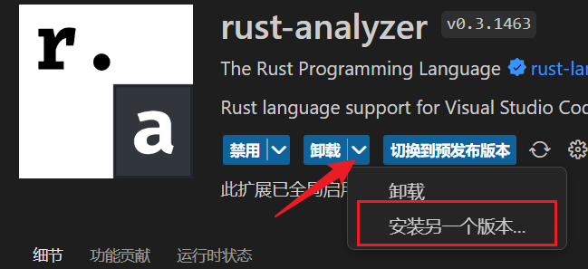

> NOTE: 有的人可能开了 rustlings 的 lsp 功能，但是仍然没有智能提示/补全功能，这可能是因为 rust-analyzer 插件更新后和当前的 rustlings 不兼容导致的，可以将 rust-analyzer 插件的版本回退，暂时解决此问题：
> 
>  

> 很多概念看一遍记不住，在学和练的过程中经常要回头看之前的章节才能想起来。

> Rust 的文档和教程中的代码片段都可以在线运行，每一个都可以运行看一下结果，加深印象和理解。

## 2023-03-27 类型系统、流程控制、模式匹配等基本概念

- 阅读《[Rust 语言圣经](https://course.rs)》基础部分内容，之前也有简单看过一些，了解了 Rust 语言的一些基本特性，包括基本数据类型、所有权概念、复合类型、流程控制和模式匹配等。

- 根据学习的内容完成了 [rustlings](https://github.com/LearningOS/rust-rustlings-creatoy) 的相关练习。

> Rust 中使用`所有权`机制和`可变性`对变量的操作进行限制，这是它的一大特点。使用时要经常注意变量的`所有权转移`问题，以及变量在一个作用域内`只能有一个可变引用`或`多个不可变引用`。

> Rust 中使用 `match` 进行匹配实现多分支的情况。match 的匹配需要列出所有匹配的情况，如匹配一个 u8 类型的数字可能就要列出 0~255 个情况。不过我们可以使用 `_` 进行通配，直接匹配所有没有列出的情形。（注意只在必要的时候使用，不然可能因为忘了处理特殊的值而出现逻辑 BUG。）

> `match` 还可以使用 guard 形式（不知道怎么翻译，看守？）进行条件约束的匹配，如下：
> ```rust
> match value {
>             x if x < 0 => println!("Negative number"),
>             x if x == 0 => println!("Zero number"),
>             x => println!("Positive number"),
>         }
> ```

## 2023-03-29 集合类型 HashMap

- 阅读《[Rust 语言圣经](https://course.rs/basic/collections/hashmap.html)》和《[Rust 程序设计语言](https://kaisery.github.io/trpl-zh-cn/ch08-03-hash-maps.html)》的 HashMap 部分。

- 完成 [rustlings](https://github.com/LearningOS/rust-rustlings-creatoy) 的相关练习。

HashMap 练习主要用到了 entry 方法获取对应的值的访问入口 (Entry)，再通过 Entry 的 or_insert 方法进行无键时的 KV 插入。使用 Entry 的 and_modify 方法可以进行有键时的值更新。

> Rust 的函数很多可以链式调用，但使用时要注意各种方法的返回类型，必要的时候要调整调用顺序。

> 在做 rustlings 练习时用到了 entry 方法，练习中 HashMap 的键是一个 String 变量，传入到 entry 方法时会转移它的所有权，再链式调用 or_insert 的时候里面用到这个键就因为所有权被转移而报错，所以我使用了 clone 方法。（用引用形式（变成了字符串切片）会报类型不匹配的错误）不知道是不是我写的有问题，有没有更好的方法？

## 2023-03-30 泛型、枚举和 Options, Result

- 阅读《Rust 语言圣经》的泛型[(2.8.1)](https://course.rs/basic/trait/generic.html)、枚举([2.4.4](https://course.rs/basic/compound-type/enum.html))和模式匹配([2.6](https://course.rs/basic/match-pattern/intro.html))的部分。

- 完成 [rustlings](https://github.com/LearningOS/rust-rustlings-creatoy) 中 Option 的相关练习。

> 模式匹配的时候可以使用 `ref` 修饰解构的变量，表示希望对这个变量进行引用而不转移所有权。这种方式和 `&` 不同，`&` 表示的是要匹配一个引用类型变量。

例如下面这段代码，如果 Some(ref p) 改成了 Some(p) 会导致 Option 变量 y 中的值所有权被转移到 p，如果改成了 Some(&p) 类型又匹配不上。
```rust
struct Point {
    x: i32,
    y: i32,
}

fn main() {
    let y: Option<Point> = Some(Point { x: 100, y: 200 });

    match y {
        Some(ref p) => println!("Co-ordinates are {},{} ", &p.x, &p.y),
        _ => println!("no match"),
    }
    y; // Fix without deleting this line.
}
```

## 2023-03-31 错误处理

相关链接：
[Result 类](https://doc.rust-lang.org/std/result/enum.Result.html) [Option 类](https://doc.rust-lang.org/std/option/enum.Option.html)

- 学习 Rust 的错误处理部分。文档章节《Rust 语言圣经》[2.11 返回值和错误处理](https://course.rs/basic/result-error/intro.html)或者《Rust 程序设计语言》[9.错误处理](https://kaisery.github.io/trpl-zh-cn/ch09-00-error-handling.html)

- 完成了 [rustlings](https://github.com/LearningOS/rust-rustlings-creatoy) 中错误处理相关练习。

Rust 的错误处理具有自己的特色。主要使用 panic!（不可恢复错误） 和 Result （可恢复错误）进行处理。

panic! 使程序直接结束并输出崩溃信息，可以在遇到程序无法自己进行处理的错误或者不能继续正常运行时（如系统异常或者无法获取到后续运行需要的资源等情况）使用。

Result<T, E> 是一个泛型的枚举类型，函数正常处理时可解构出结果，处理失败时可解构出错误信息。Result 的 unwrap 方法可以简单粗暴的解包 Ok 的结果，但是当其是 Err 时也简单粗暴地 panic 了。如果能确定得到的 Result 一定是 Ok，那就能愉快地用 unwrap。类似的还有 expect 方法，区别只是你可以自定义 panic 的信息。

Result<T, E> 和 Option<T> 很相似，只不过 Option<T> 是用于有没有值的包装（None 的情况不会包含额外的数据），Result<T, E> 是对函数执行情况的包装（Ok(T) 成功时的结果/Err(E) 失败时的错误信息）。

有时候我们只想在本函数内完成正常的功能，不想直接处理错误，而是将错误时的情况传递给更上层的函数。这时就可以在匹配到 Err 的时候给它 return 出去（这个函数的返回值类型也得是个 Result 类型）。不过 Rust 给我们提供了一个更方便的符号 `?`，`？` 就相当于一次对 Result 或 Option 的模式匹配，当结果是 Ok / Some 时`解构出其中的值`，当结果是 Err / None 时，会将其返回出去。
如下面的函数，当 open 和 read_to_string 都获得了正常的结果时会运行到最后返回 Ok(s)，如果前面出现 Err 就会直接将错误返回。
```rust
use std::fs;
use std::fs::File;
use std::io;
use std::io::Read;

fn read_username_from_file() -> Result<String, io::Error> {
    let mut f = File::open("hello.txt")?;
    let mut s = String::new();
    f.read_to_string(&mut s)?;
	// 上面两行也可以直接像这样进行链式调用，效果相同
	// File::open("hello.txt")?.read_to_string(&mut s)?;
    Ok(s)
	// 或者上面几行用下面这行标准库的函数直接完成
	// fs::read_to_string("hello.txt")
}
```

> 注意 `?` 匹配出 Ok 或 Some 是直接解构出其中的值的，所以这个值是不能作为返回 Resut / Option 类型的函数的返回值的，而是要再包装一下才行。如下面的这个函数就会报错
> ```rust
> fn first(arr: &[i32]) -> Option<&i32> {
>     arr.get(0)?
>     // 需要写成下面这样才行
>     // let v = arr.get(0)?;
>     // Some(v)
> }
> ```

## 2023-04-01 泛型练习、特征、生命周期和自动化测试

- 学习 Rust 的泛型、特征、生命周期和自动化测试部分。文档章节《Rust 程序设计语言》[10.泛型、Trait 和生命周期](https://kaisery.github.io/trpl-zh-cn/ch10-00-generics.html) [11.编写自动化测试](https://kaisery.github.io/trpl-zh-cn/ch11-00-testing.html) 或者《Rust 语言圣经》[2.8.泛型和特征](https://course.rs/basic/trait/intro.html) [2.10.认识生命周期](https://course.rs/basic/lifetime.html) [8.编写测试及控制执行](https://course.rs/test/intro.html)

- 完成了 [rustlings](https://github.com/LearningOS/rust-rustlings-creatoy) 中泛型、特征和生命周期相关练习。

### 泛型

使用泛型需要提前声明，结构体、枚举等的泛型声明在其名字后面，为泛型实现方法时，还要在 impl 后面声明泛型类型。

```rust
struct Point<T, U> {
    x: T,
    y: U,
}
impl<T, U> Point<T, U> {
    fn x(&self) -> &T {
        &self.x
    }
	fn y(&self) -> &U {
        &self.y
    }
    fn mixup<V, W>(self, other: Point<V, W>) -> Point<T, W> {
        Point {
            x: self.x,
            y: other.y,
        }
    }
}
impl<T> Point<T, T> {
	fn foo(&self) {
        println!("x: {} and y: {} have same type.", self.x, self.y);
    }
}
impl Point<i32, String> {
	fn bar(&self) {
		println!("x: {} is an integer, and y: {} is a string.", self.x, self.y);
	}
}
```

> 上面的 mixup<V, W> 是泛型类型 Point<T, U> 的泛型方法，要在方法名后面声明用于 other 参数的泛型类型。
> 像上面的示例一样，也可以为特定的类型组合实现特定的方法。当类型匹配时就可以调用对应的方法。

另外有一个 const 泛型，可以将值作为泛型声明，根据值的不同也会生成不同的类型/函数。声明的方式是：
```rust
fn display_array<T: std::fmt::Debug, const N: usize>(arr: [T; N]) {
    println!("{:?}", arr);
}
fn main() {
    let arr: [i32; 3] = [1, 2, 3];
    display_array(arr);
    let arr: [i32; 2] = [1, 2];
    display_array(arr);
}
```
const 泛型声明时要指定类型。上面这个例子里如果不使用泛型方法是没法传递数组进去的，因为 3 个元素和 2 个元素的数组是不同的类型。

### 特征

Rust 中的特征 (Trait) 可以为不同的类型实现相同的行为，或者为已有的类型实现拓展的方法。使用 trait 关键字声明一个特征，它内部的方法可以写实现（默认实现），也可以不写实现。如下：
```rust
trait MyTrait {
    fn foo(&self) {
        println!("A default function.")
    }
    fn bar(&self) -> &str;
}
struct MyStruct {
    info: String,
}
// 为类型实现特征，和为类型实现方法很相似，但是多了特征名和 for
impl MyTrait for MyStruct {
    fn bar(&self) -> &str {
        return &self.info;
    }
}
// 限定函数参数和返回值是实现了特征的类型
fn zap(v: &impl MyTrait) -> impl MyTrait {
// 也可以写成这样的形式
// fn zap<T: MyTrait>(v: &T) -> impl MyTrait {
// 或这样的形式
// fn zap<T>(v: &T) -> impl MyTrait
//     where T: MyTrait {
    v.foo();
    MyStruct {
        info: "foo bar zap".into()
    }
}
```
像上面的例子一样，特征也可以用来指定函数或返回值是实现了某些特征的类型，而不关系具体的类型是什么。

### 生命周期

生命周期是一种特殊的泛型标注，用来提示编译器标注到的引用的生命周期长度。其使用方式如下：
```rust
// 函数参数和返回值的生命周期标注（参数和返回值的生命周期可以不同，用不同的名字标注就行）
// 注意，和泛型声明一样，生命周期也要事先声明（函数名、结构名和 impl 后面<'lifetime>）
fn longest<'a>(x: &'a str, y: &'a str) -> &'a str {
    if x.len() > y.len() {
        x
    } else {
        y
    }
}
// 结构体内引用字段的生命周期标注
struct ImportantExcerpt<'a> {
    part: &'a str,
}
// 实现方法时也要标注出生命周期（和泛型声明一样）
impl<'a> ImportantExcerpt<'a> {
    fn level(&self) -> i32 {
        3
    }
}
// 可以用这样的形式表示 'a 被 'b 引用，即 'a 生命周期大于等于 'b
// 类似于泛型的特征约束
impl<'a: 'b, 'b> ImportantExcerpt<'a> {
    fn announce_and_return_part(&'a self, announcement: &'b str) -> &'b str {
        println!("Attention please: {}", announcement);
        self.part
    }
}
fn main() {
    let novel = String::from("Call me Ishmael. Some years ago...");
    let first_sentence = novel.split('.').next().expect("Could not find a '.'");
    let i = ImportantExcerpt {
        part: first_sentence,
    };
}
```
生命周期标注并不会改变引用的生命周期，只是提示编译器程序员对这些引用预期的生命周期长度（例如 longest 函数中，预期的生命周期是 x, y 和返回值三者中最短的生命周期长度(三者标注的生命周期都是 'a)）。这样编译器就可以通过标注检查出来字段/返回值正确的生命周期，并再不满足要求时报错提示。

### 自动化测试
运行 cargo test 启动自动化测试，下面是一个简单的自动化测试文件的部分内容
```rust
#[cfg(test)]
mod tests {
    #[test] // 测试函数注解，表示紧跟着的是一个测试函数
    fn it_works() {
        let result = 2 + 2;
        assert_eq!(result, 4); // 函数运行成功，测试通过
    }
}
```

## 2023-04-02 函数式语言功能：闭包和迭代器

- 阅读教程，文档章节《Rust 程序设计语言》[13.Rust 中的函数式语言功能：迭代器与闭包](https://kaisery.github.io/trpl-zh-cn/ch13-00-functional-features.html)《Rust 语言圣经》[4.2.函数式编程：闭包、迭代器](https://course.rs/advance/functional-programing/intro.html)

- 完成了 [rustlings](https://github.com/LearningOS/rust-rustlings-creatoy) 中迭代器相关练习。

### 闭包
闭包的声明格式：| param_list | expression，即用一对 `|` 包裹参数列表，紧跟着闭包的包体表达式
```rust
let mut x = 5;
let add_y = |y: i32| -> i32 {
    x + y
};
// 上面的闭包可以直接写成下面这样的形式
// let add_y = |y| x + y;
// 默认的形式对变量的捕获是不可变的，如果是可变的捕获需要下面这样
// let mut add_y = |y| {x += y; x};
// 如果闭包捕获变量时同时也要转移所有权，则是下面这样
// let mut add_y = move |y| {x += y; x};
println!("Result is: {}", add_y(4));
```
和函数的参数必须标注类型不同，闭包的参数类型标注可以省略，只有在闭包没有被使用的情况下才强制要求标注参数类型。
使用闭包作为结构体成员时，也需要标注闭包的特征（限定这个闭包成员的形式）
```rust
struct Cacher<T, U>
where
    T: Fn(U) -> U,
{
    query: T,
    value: Option<U>,
}
impl<T> Cacher<T>
where
    T: Fn(U) -> U,
{
    fn new(query: T) -> Cacher<T> {
        Cacher {
            query,
            value: None,
        }
    }
    // 先查询缓存值 `self.value`，若不存在，则调用 `query` 加载
    fn value(&mut self, arg: U) -> U {
        match self.value {
            Some(v) => v,
            None => {
                let v = (self.query)(arg);
                self.value = Some(v);
                v
            }
        }
    }
}
```
上面 Fn(U) -> U 表示闭包的特征标注。根据闭包捕获变量的形式不同有三种不同的标注：
- Fn 不可变借用捕获
- FnMut 可变借用捕获
- FnOnce 转移所有权捕获

像特征一样，闭包也可以用来标注返回值，用于约束返回值实现了闭包特征。并且同样是使用和特征约束相同的形式（impl Fn(T) -> R 这种，对应到特征就是 impl TraitName 的形式）

### 迭代器
实现了 [Iterator](https://doc.rust-lang.org/std/iter/trait.Iterator.html) 特征的类型可以使用迭代器的相关方法：
- 迭代器适配器：
  - zip 把两个迭代器合并成一个迭代器，新迭代器中，每个元素都是一个元组，由之前两个迭代器的元素组成。例如将形如 [1, 2, 3, 4, 5] 和 [2, 3, 4, 5] 的迭代器合并后，新的迭代器形如 [(1, 2),(2, 3),(3, 4),(4, 5)]
  - map 是将迭代器中的值经过映射后，转换成新的值[2, 6, 12, 20]
  - filter 对迭代器中的元素进行过滤，若闭包返回 true 则保留元素[6, 12]，反之剔除
  - enumerate 返回 (索引，值) 的迭代器，枚举索引和容器内元素
- 消费者适配器：
  - sum 对迭代器中的所有元素求和
  - collect 将迭代器内的元素转换成容器
  - fold 对迭代器中的所有值进行累积运算，产生一个最终的结果

实现了 IntoIterator 特征的类型可以转换为迭代器：
- into_iter 会夺走所有权
- iter 是借用
- iter_mut 是可变借用

## 2023-04-04 智能指针

- 阅读教程，文档章节《Rust 程序设计语言》[14.智能指针](https://kaisery.github.io/trpl-zh-cn/ch15-00-smart-pointers.html)《Rust 语言圣经》[4.4.智能指针](https://course.rs/advance/smart-pointer/intro.html)

- 完成了 [rustlings](https://github.com/LearningOS/rust-rustlings-creatoy) 中智能指针相关练习。

### 智能指针
- Box\<T>
  - 用于在堆上分配内存
  - 特征对象 Box<dyn TraitName>

- Deref 特征
  - 实现解引用操作 *
  - deref 会自动尝试解引用直到匹配程序需要的类型（编译时）

- Drop 特征
  - 进行收尾工作和资源释放
  - 实现了 Drop 特征的类型无法同时实现 Copy 特征，它们两个是互斥的。

- Rc\<T> Arc\<T>
  - 带引用计数的智能指针，当 drop 到引用计数为 0 时才会真正释放资源。
  - 指向底层数据的不可变引用，需要配合 RefCell 或 Mutex 才能进行修改。
  - Rc\<T> 只能用于一个线程内，想要多线程共享需要使用原子化的引用计数指针 Arc\<T>

- Cell\<T> RefCell\<T>
  - 内部可变性，可以在拥有不可变引用的同时修改目标数据。需要使用 get 和 set 方法对内部数据进行读写。
  - Cell\<T> 用于可 Copy 的值，RefCell\<T> 用于引用。
  - 使用 RefCell 时会将编译器的借用检查推迟到运行期（并不会消除，用于编译器在一些模棱两可情况时默认选择报错的情况下进行规避），运行期借用检查冲突时会产生 panic。
  - 使用 RefCell 的方法可以对内部的引用进行不可变引用 borrow() 或可变引用 borrow_mut()
  - Cell 没有额外的性能损耗，RefCell 包含了一个字的借用状态指示，需要在运行时进行借用检查，所以空间和时间效率都有一点开销。

- Rc\<T> 和 RefCell\<T> 配合，实现一个数据拥有多个所有者并且可被修改。
  ```rust
  use std::cell::RefCell;
  use std::rc::Rc;
  fn main() {
      let s = Rc::new(RefCell::new("我很善变，还拥有多个主人".to_string()));
      // 这里对 Rc 进行引用有两种方法，使用关联函数 Rc::clone(&other) 和使用 clone 方法，推荐的是前者。
      let s1 = Rc::clone(&s);
      let s2 = s.clone();
      s2.borrow_mut().push_str(", on yeah!");
      println!("{:?}\n{:?}\n{:?}", s, s1, s2);
  }
  ```
  需要保证 RefCell 在同一作用域范围内只有一个可变借用。（在上面的例子中如果将 s2.borrow_mut() 一行再复制一行也能正常运行，因为可变借用是发生在方法内部的，在其作用域内只有这一个借用）

## 2023-04-05 多线程、宏

- 阅读教程，文档章节《Rust 程序设计语言》[16.无畏并发](https://kaisery.github.io/trpl-zh-cn/ch16-00-concurrency.html) [19.5 宏](https://kaisery.github.io/trpl-zh-cn/ch19-06-macros.html)；《Rust 语言圣经》[4.6.多线程并发编程](https://course.rs/advance/concurrency-with-threads/intro.html) [4.10.宏编程](https://course.rs/advance/macro.html)

- 完成了 [rustlings](https://github.com/LearningOS/rust-rustlings-creatoy) 中多线程、宏相关练习，以及余下的几个练习。

### 多线程
- 使用 thread::spawn 创建线程
- join 方法等待线程结束
- 当主线程结束时，所有子线程也会终结（包括子线程的子线程）


### 宏
- 声明宏 macro_rules!
  - 使用 #[macro_export] 导出宏
  - 宏参数使用美元符号 `$` 作为前缀，并使用 `:` 后加指示符来标注参数类型，参数可以是以下类型。
    - block
    - expr 用于表达式
    - ident 用于变量名或函数名
    - item
    - pat (模式 pattern)
    - path
    - stmt (语句 statement)
    - tt (标记树 token tree)
    - ty (类型 type)
  - 宏可以进行重载，匹配多种模式，使用 `;` 分隔各分支。

- 过程宏
  - 自定义 #[derive] 宏在结构体和枚举上指定通过 derive 属性添加的代码
  - 类属性（Attribute-like）宏定义可用于任意项的自定义属性
  - 类函数宏看起来像函数不过作用于作为参数传递的 token
